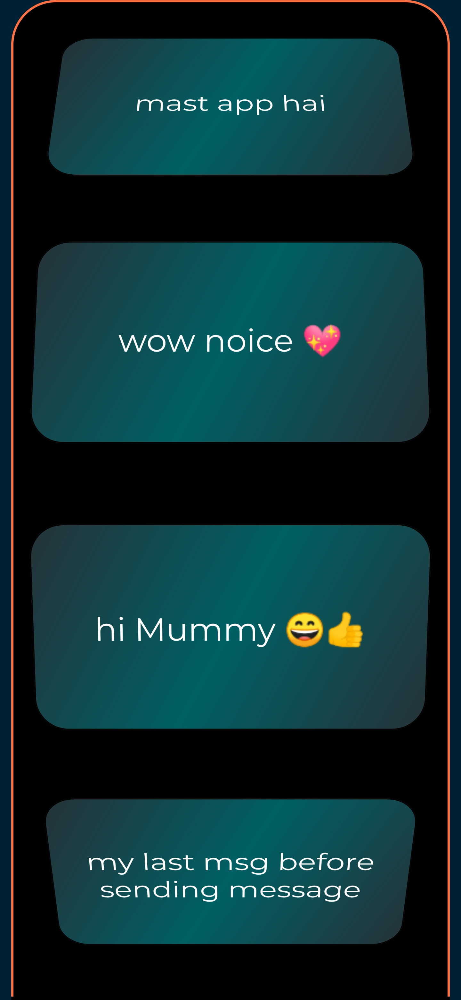

# message_app

A new Flutter project.

## Getting Started

This project is a starting point for a Flutter application.

A few resources to get you started if this is your first Flutter project:

- [Lab: Write your first Flutter app](https://flutter.dev/docs/get-started/codelab)
- [Cookbook: Useful Flutter samples](https://flutter.dev/docs/cookbook)

 
 
 
Also adding My Google Drive Link --><b> <u><a href="https://drive.google.com/file/d/1IqDe7IswlTHCs-g9lCHgjwaZWlFIpRXL/view?usp=drivesdk"> message_app Link </a></u></b>
 
 
For help getting started with Flutter, view our
[online documentation](https://flutter.dev/docs), which offers tutorials,
samples, guidance on mobile development, and a full API reference.

